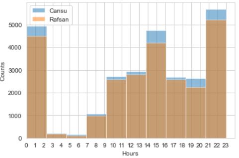

# **Analysis of WhatsApp Messages using NLP : Project Overview**

* Performed Data analysis to determine texting behaviours for each person in a given real Whatsapp dataset.
* The analysis included data cleaning, data visualizations and EDA to understand texting patterns for each person.

# **Code and Resources used**

The [notebook](https://gitlab.com/cansuyalcin/projects_portfolio/-/blob/master/Personal%20Projects/Analysis%20of%20WhatsApp%20Messages%20using%20NLP/nlp_analysis_on_whatsapp_massages_cr.ipynb)"notebook" is available in here. 

* The data contained time period between 08-10-2019 and 06-02-2021 overall 53895 lines of message data from Whatsapp app. 

** Python version **  : 3.7
** Packages ** : pandas, numpy, matplotlib, seaborn, wordcloud, PIL, io, sys, glob, os

In the wordcloud part I get inspired from [francisatoyebi's](https://github.com/francisatoyebi/NLP---Whatsapp-Chat) work.

# **Results**

The project determines,

    * The most frequent messages sent for each person.
    * The distribution of number of messages based on hours and months for each person.
    * The comparison of the amount of messages based on texting hours and months for each person.
    * The Wordcloud image 

Based on hours, I was the one who send more messages almost every time interval exculiding the interval 2-5 am. 
So now, it is easy to predict when Rafsan reply back based on this chart! 

The comparison of texting behaviours

