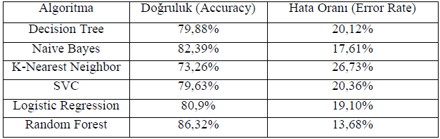

# The customer churn analysis

This project aimed to analyze the loss of customers by employing and comparing several machine learning algorithms such as: random forest, naive bayes, KNN etc. Knime Analytics Platform and Python were used. Implementations were both made in Knime and Python. I have completed this project during one of my internships.

| ![Images/algorithms.PNG] | 
|:--:| 
| *The algorithms used* |

# Resources

Data: The data is gotten from Kaggle.
Python version: 3
Packages/softwares: pandas, numpy, sklearn, seaborn, Matplotlib, Knime Analytics Platform

