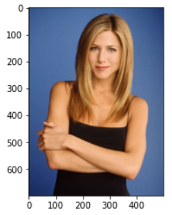
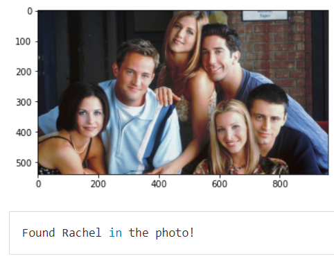

# Project Overview

This project contains the fundamentals of the face recognition. Since I have a special interest in this subject, I created my own small-scale dataset and implemented it. I shared my codes from my linkedIn account for people who are interested in face recognition applications and want to start.

The project consists of 3 parts

#### part 1: Number of faces in a picture and the location of each face. 

#### part 2: Face Landmark Estimation and Face Alignment.

#### part 3: Face Encoding and Deep Metric Learning. Training with a person's different picture then finding it in other picture. 

