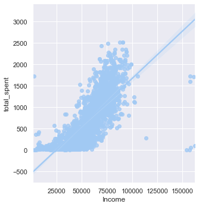
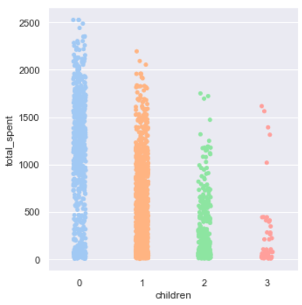
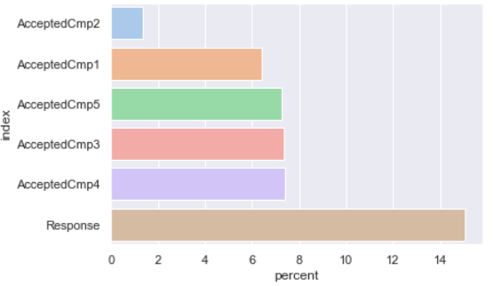

#  Marketing Analytics : Project Overview

This project aims to perform EDA, Statistical Analysis, and Data Visualizations in order to determine,
1. Customer profiles
2. Product preferences
3. Campaign successes/failures
4. Channel performance

## Resources

Data: The data is gotten from [Kaggle](https://www.kaggle.com/jackdaoud/marketing-data "Kaggle data") --

Python version: 3.7 --

Packages: pandas, numpy, sklearn, seaborn, Matplotlib

## What you will find in this [notebook](https://gitlab.com/cansuyalcin/projects_portfolio/-/blob/master/Personal%20Projects/Marketing%20Analytics/Marketing_Analytics.ipynb "notebook")

* Exploratory analysis using Pandas Profiling
* Exploratory Analysis and Data Visualizations with Seaborn and Matplotlib
* Feature Engineering and Selection

## Conclusion 

### Customer Profile

**Target customer** in order to increase the sales,

* Prefably has income between 50000-75000
* Has least amount of children. (0,1) possible.
* for enrollment, 44 years old. Interval (40,50) is possible.
* has income of approximately $52000
* was born in 1969
* made a purchase 49 days ago
* became customer 8 (2762 days) years ago.
* made 2 deal purchase, 4 web purchase, made 2 catalog purchase, 5 store purchase,
* visited web siste 5 times in a month
* spent Over 300 Dollars on wine
* spent 26 Dollars on Fruits and Sweet Products
* spent 167 Dollars on Meat products
* spent 37-43 Dollars on Fist and Gold Products

### Summary

* Target customer profile, sales chanels and product preferences are determined.
* Advertising campaign acceptance is negatively correlated with childrean (kids/teens) and positively correlated with having income. 
Suggestion: Focus on group with high income and without children (or children<3)
* The most succesful sales channels were Store purchases and Web purchases. Suggestion: Specific campains for these channels to increase sales.
* The most successful products were Wines and Meats (customers spent on these products most). 
Suggestion: Specific campains for these products to increase sales.
* The most succesful campain was the last one. (the last campain named as Response)

