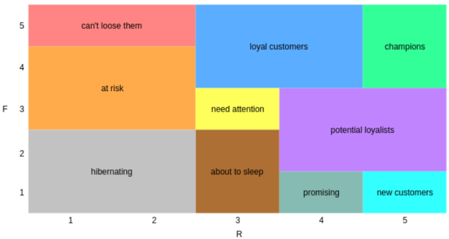

# **RFM analysis for Customer Segmentation : Project Overview**

* Performed Data analysis to determine Customer segments based on RFM (Recency, Frequency and Monetary) values of each customer.
* The analysis included Data Understanding, Data Preprocessing, EDA and the Customer Segmentation using RFM calculations. 
* The goal is to determine customer segments based on their purchasing behaviors. In this way, customized operations can be prepared for each segment.

# **Code and Resources used**

The [Notebook](https://gitlab.com/cansuyalcin/projects_portfolio/-/blob/master/Personal%20Projects/RFM%20analysis%20for%20Customer%20Segmentation/RFM-analysis.ipynb) is available in here. 

**Data**: The [Dataset](https://archive.ics.uci.edu/ml/datasets/Online+Retail+II)

The Online Retail II data set contains all the transactions occurring for a UK-based and registered, non-store online retail between 01/12/2009 and 09/12/2011.The company mainly sells unique all-occasion gift-ware. Many customers of the company are wholesalers.

Coloums Features: 

* Invoice: Invoice number. Nominal. A 6-digit integral number uniquely assigned to each transaction. If this code starts with the letter 'c', it indicates a cancellation.
* StockCode: Product (item) code. Nominal. A 5-digit integral number uniquely assigned to each distinct product.
* Description: Product (item) name. Nominal.
* Quantity: The quantities of each product (item) per transaction. Numeric.
* InvoiceDate: Invice date and time. Numeric. The day and time when a transaction was generated.
* Price: Unit price. Numeric. Product price per unit in sterling (£).
* CustomerID: Customer number. Nominal. A 5-digit integral number uniquely assigned to each customer.
* Country: Country name. Nominal. The name of the country where a customer resides.

**Python version**: 3.7

**Packages**: pandas, numpy, matplotlib, seaborn, datetime

# **Results**

The customer segments were created based on RFM Analysis.   

